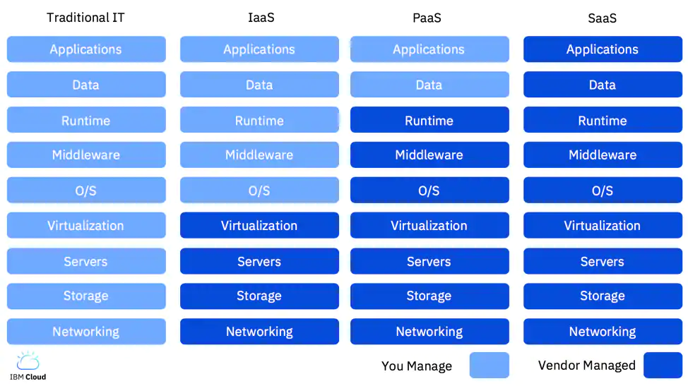

# IBM Cloud - Getting Started

## What is Cloud
Cloud makes advanced computing resources available at scale via elastic services, by self-service, and at a cost-effective value (pay-as-you-go), while offering the latest technologies, such as Artificial Intelligence (AI), Machine Learning (ML), Data Analytics, container services like Kubernetes, Internet of Things (IoT), high-performance computing, Blockchain and Quantum computing. 

## Virtualization
Cloud can accomplish all that through [Virtualization](https://www.ibm.com/cloud/learn/virtualization-a-complete-guide). Virtualization uses software to create an abstraction layer over computer hardware that allows the hardware elements of a single computer — processors, memory, storage and more — to be divided into multiple virtual computers, commonly called virtual machines (VMs). But not only hardware can be virtualized, many other IT infrastructure elements can be virtualized, like Networking, Applications, Data,  Desktops or Containers. Especially [Containers](https://www.ibm.com/cloud/learn/containers) are becoming a more and more important element in Cloud Computing and Modern Application development.

Virtualization offers:
* Resource efficiency,
* Easier Management,
* Minimal downtime,
* Faster provisioning.

## as-a-Service
When you [Learn about Cloud Computing] (https://www.ibm.com/cloud/learn/cloud-computing), you will often hear that Cloud is being divided into the following as-a-Service layers:
1. Infrastructure as a Service (IaaS),
2. Platform as a Service (PaaS),
3. Software as a Service (SaaS), and lately 
4. Functions-as-a-Service (FaaS).

### Infrastructure-as-a-Service (IaaS)
Infrastructure-as-a-Service (IaaS) has become more popular lately with the use of so-called container orchestration services like Kubernetes and so-called serverless computing.  

Good examples of Infrastructure-as-a-Service (IaaS) are bare metal servers, Virtual Machines (VMs), storage like NFS-based storage, Object Storage, backup, and networking.

### Platform-as-a-Service (PaaS)
Platform-as-a-Service (PaaS) offers computing services like security, scalability that help you to develop, run and manage your applications. 

[Kubernetes](https://kubernetes.io/) is a popular example of IaaS. Kubernetes is an open-source system automating deployment, scaling, and management of containerized applications like Docker containers. 

PaaS can also provide just a runtime environment or middleware services.

If you are a server-side, back-end or data engineer, you will likely use PaaS.

### Software-as-a-Service (SaaS)
Most developers might use cloud for consuming or deploying applications and data, often via REST APIs. This form of cloud is called Software-as-a-Service (SaaS). 

If you write front-end applications or mobile clients, you probably are using API based cloud services. 

### Functions-as-a-Service (FaaS)
[Serverless](https://www.ibm.com/cloud/learn/serverless) computing or Functions-as-a-Service (FaaS) allow developers to focus fully on writing and deploying single functions without worrying about the management and operation of the infrastructure at all.

## Public, Private, Hybrid, On-Prem and Multicloud 

Another way people talk about Cloud is in terms of Public Cloud, Private Cloud, Hybrid Cloud, On-Prem Cloud and Multicloud. 

## Shared, Dedicated, and Bare Metal

From the perspective of virtualization and security, you can also think of Cloud in terms of shared resources, dedicated resources or bare metal resources. This has to do with how isolated your computing resources are from other computing resources.

By default, when you use a Public Cloud your will share resource instances with other users. Some organizations however have a security requirement that will not allow them to share instances and they require resources that are completely dedicated to their services. When you require bare metal, you don't use the virtualization layers that come with cloud at all, and you choose the manage the hardware yourself.

# Getting Started

Enough theory, let's code! 

Most Cloud providers offer utility CLIs and SDK, like the IBM Cloud CLI and IBM Cloud Developer Tools. Lab0 helps you setup the IBM Cloud tools.

The easiest way to get started with Cloud is to use one of the many APIs. Lab1 teaches how you can use IBM Watson APIs like Visual Recognition.

Once you are deploying applications to the Cloud, you need a way to update the cloud application with the code you wrote and tested on your local machine or the code in your code repository like Github or Bitbucket. Lab2 teaches you how to code and update cloud applications.

The easiest and fastest way to deploy code to cloud is by using Serverless Functions, where you create single functions you access through an API. Lab3 helps you create a serverless function.

# Labs

* Lab0, Developer Setup - see [Lab0](Lab0/README.md),
* Lab1, Get Started using IBM Watson APIs - see [Lab1](Lab1/README.md),
    * [Visual Recognition](https://cloud.ibm.com/catalog/services/visual-recognition),
    * [Language Translator](https://cloud.ibm.com/catalog/services/language-translator),
* Lab2, Using Serverless Functions,
* Lab3, Get Started with Kubernetes and Docker,
